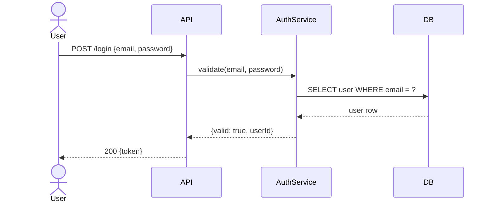
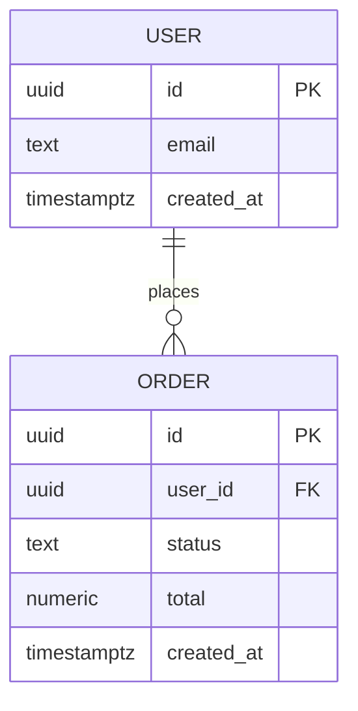
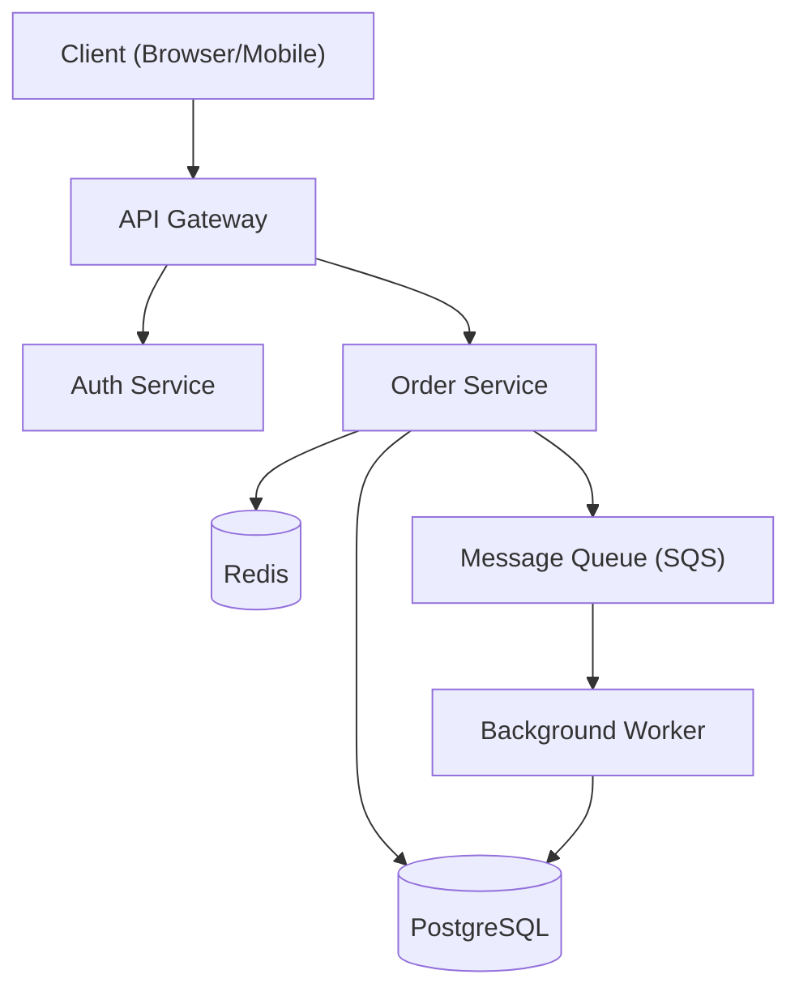
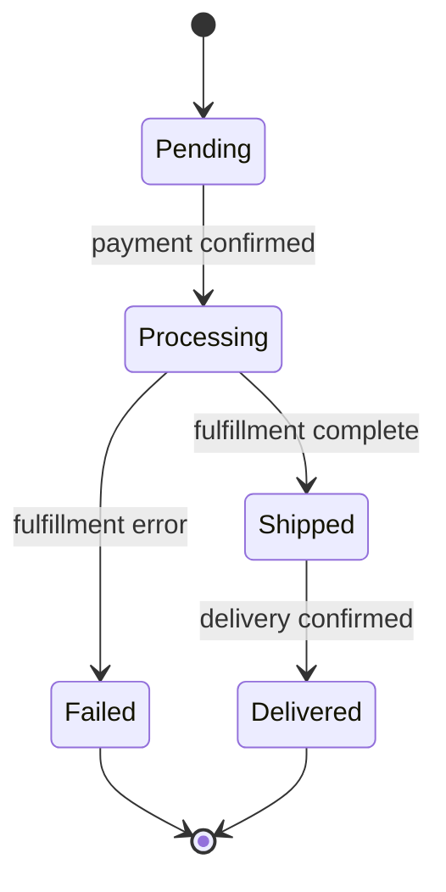

This skill guides the creation of clear, accurate, and useful technical diagrams for backend systems using Mermaid or PlantUML syntax.

The user provides a system, feature, or flow to visualize. They may include existing code, a design description, or just a high-level idea.

## Design Thinking

Before drawing, choose the right diagram type for the story being told:
- **Sequence diagram** — for showing how services/components communicate over time (request/response, async events)
- **ERD** — for showing data models and their relationships
- **Architecture diagram** — for showing system components, their boundaries, and how they connect
- **Flowchart** — for showing decision logic, process steps, or branching paths
- **State machine** — for showing how an entity transitions between states

Then produce a diagram that is:
- Focused on one concern per diagram — don't mix architecture and sequence in one
- Accurate to the actual system, not idealized
- Readable at a glance — label every arrow, name every component clearly

## Diagram Guidelines

### Sequence Diagrams (Mermaid)
Use for: API calls, service-to-service flows, async job processing, auth flows.

Rules:
- Use `actor` for humans, `participant` for services/systems
- Solid arrow `->>`  for requests, dashed `-->>`  for responses
- Use `alt`/`else` blocks for branching (success vs error)
- Include error paths — not just the happy path

### ERD (Mermaid)
Use for: data modeling, schema reviews, relationship visualization.

Rules:
- Always include PK and FK annotations
- Use relationship labels that read naturally: `"places"`, `"belongs to"`, `"contains"`
- Include the most important columns only — not every field

### Architecture Diagrams (Mermaid flowchart)
Use for: system overview, component boundaries, deployment topology.

Rules:
- Group related components visually using subgraphs
- Use consistent node shapes: rectangles for services, cylinders `[(" ")]` for datastores, parallelograms for queues
- Label every edge with the protocol or action: `HTTP`, `SQL`, `publishes`, `consumes`

### State Machine (Mermaid stateDiagram)
Use for: order lifecycle, payment status, job status, approval workflows.

Rules:
- Every state should have at least one outbound transition (except terminal states)
- Label every transition with the event or condition that triggers it
- Include error/failure states — they're often the most important

## Output Format

For each diagram:
1. **Diagram type** and rationale for choosing it
2. **Mermaid/PlantUML code block** — ready to paste and render
3. **Narrative walkthrough** — 3–5 sentences explaining what the diagram shows
4. **Key decisions visible in the diagram** — e.g., "Auth is a separate service", "DB writes go through a queue"
5. **What's intentionally omitted** — to keep the diagram focused