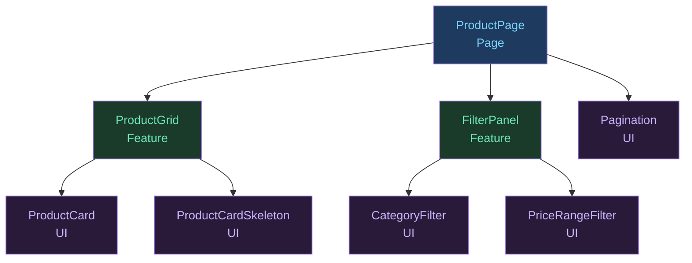
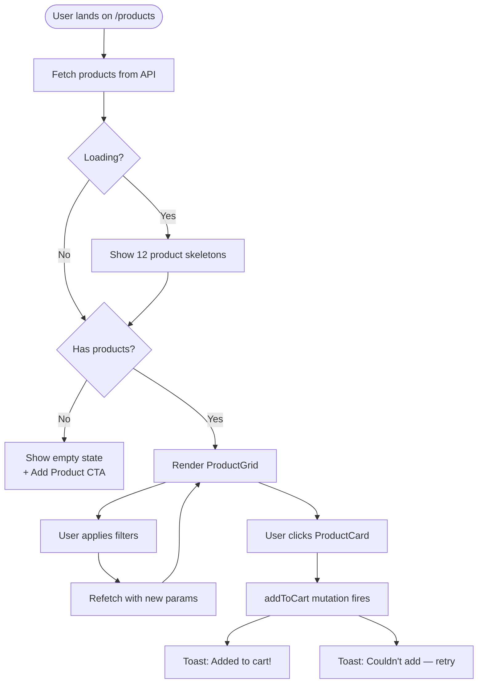
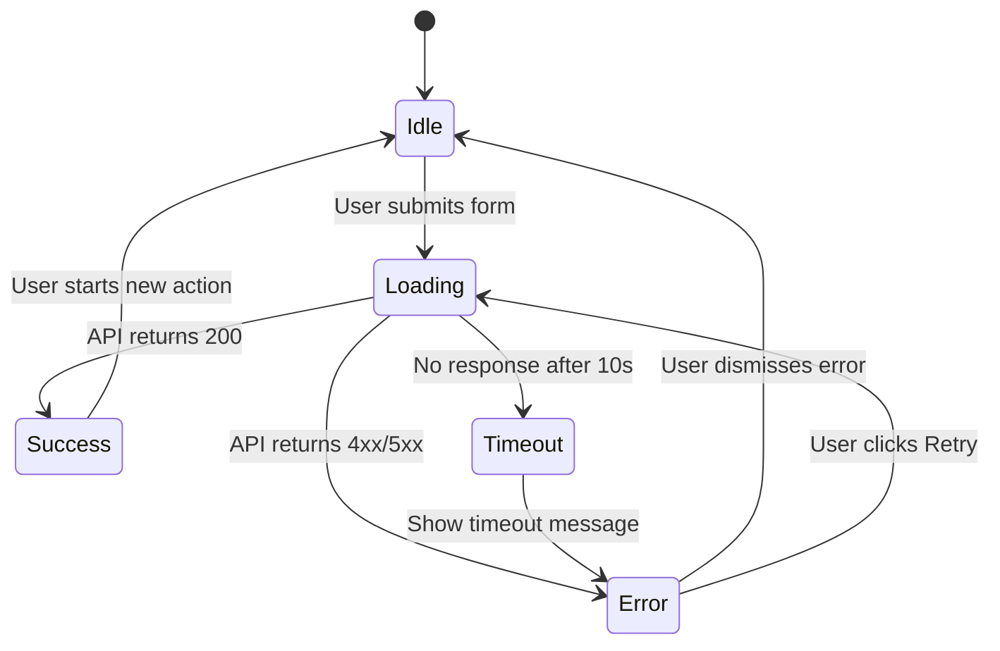
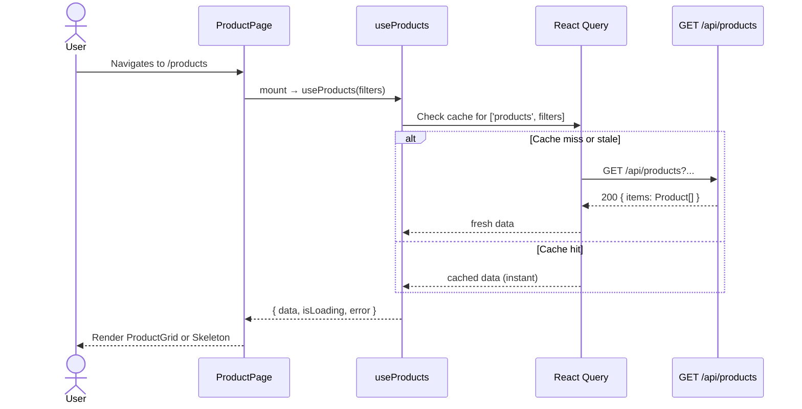

This skill guides the agent to produce clear, accurate diagrams in Mermaid syntax that illustrate the feature's architecture, data flow, and state transitions.

## Goal

Produce diagrams that answer these questions visually:
1. **Component tree** — What renders what?
2. **Data flow** — Where does data come from and where does it go?
3. **User flow** — What are the steps from entry to goal?
4. **State machine** — What states does the feature move through?
5. **Sequence diagram** — How do the system components interact over time?

---

## Diagram Type Selection

| What to show | Diagram type | Mermaid keyword |
|---|---|---|
| Component parent-child relationships | Tree / Graph | `graph TD` |
| Data moving between layers | Flow / Graph | `graph LR` |
| User steps through a feature | Flowchart | `flowchart TD` |
| UI states and transitions | State machine | `stateDiagram-v2` |
| API request/response sequence | Sequence | `sequenceDiagram` |
| Page/screen navigation | Flowchart | `flowchart TD` |
| Decision logic | Flowchart | `flowchart TD` |

---

## Diagram 1 — Component Tree

Shows which components render which children.



Rules:
- Pages at the top (blue)
- Feature/smart components in the middle (green)
- Pure UI components at the bottom (purple)
- Label each node with: `[ComponentName\nType]`

---

## Diagram 2 — Data Flow

Shows how data moves: API → hook → component → user action → mutation → API.

```mermaid
graph LR
  API[GET /api/products] -->|useProducts| Store[(React Query Cache)]
  Store -->|products[]| ProductGrid
  ProductGrid -->|product| ProductCard
  User([User]) -->|click Add to Cart| ProductCard
  ProductCard -->|onAddToCart| CartStore[(Zustand cartStore)]
  CartStore -->|POST /api/cart| CartAPI[POST /api/cart]
  CartAPI -->|invalidate cart| Store
```

Rules:
- APIs on the left
- Components in the middle
- User interactions and side effects on the right
- Label every arrow with what flows through it
- Use `[( )]` for data stores, `([ ])` for external actors (User, API)

---

## Diagram 3 — User Flow / Happy Path

Shows the steps a user takes from entry to goal completion.



Rules:
- Start with `([...])` rounded stadium shape
- Decision points with `{...}` diamond shape
- Normal steps with `[...]` rectangle
- End states with `((...))` circle
- Label every branch clearly

---

## Diagram 4 — State Machine

Shows the states a component or feature moves through.



Rules:
- Start with `[*]`
- Label every transition with the event that triggers it
- Include error and timeout states — not just happy path
- Keep states noun-like: `Idle`, `Loading`, `Success`, `Error`

---

## Diagram 5 — Sequence Diagram

Shows the order of interactions between the user, components, and APIs over time.



Rules:
- Actors on the left (`actor User`)
- Services/components as `participant`
- Use `-->>` for responses (dashed), `->>` for requests (solid)
- Use `alt/else/end` for conditional paths
- Keep to 5–8 participants maximum

---

## Mermaid Syntax Rules

```
DO:
- Use descriptive node labels
- Add \n for line breaks in node labels
- Keep diagrams focused (one concern per diagram)
- Test diagrams render correctly before including

DON'T:
- Use special characters in node IDs (stick to alphanumeric)
- Make one diagram show everything (split into multiple)
- Use >4 levels of nesting in graph diagrams
- Forget to close all subgraph blocks
```

---

## Output Format

For each diagram, output:

````
### [Diagram Name]

[One sentence describing what this diagram shows]

```mermaid
[diagram code]
```
````

Always produce at minimum:
1. **Component Tree** — for any feature with more than 2 components
2. **User Flow** — for any feature with user interaction steps
3. **State Machine** — for any feature with async operations (loading/error/success)

Optionally add:
4. **Data Flow** — when state management is complex
5. **Sequence Diagram** — when API interaction sequence matters

---

## Labeling Conventions

| Element | Convention |
|---|---|
| Page component | `[ComponentName\n(Page)]` |
| Feature/smart component | `[ComponentName\n(Feature)]` |
| UI/presentational component | `[ComponentName\n(UI)]` |
| API endpoint | `[METHOD /path]` |
| Data store | `[(StoreName)]` |
| User / external actor | `([User])` |
| Decision | `{Condition?}` |
| Terminal state | `((Done))` |